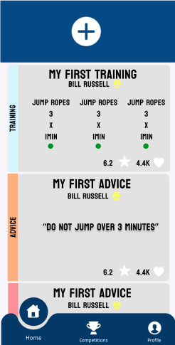
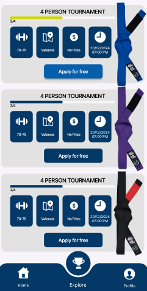
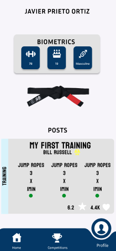
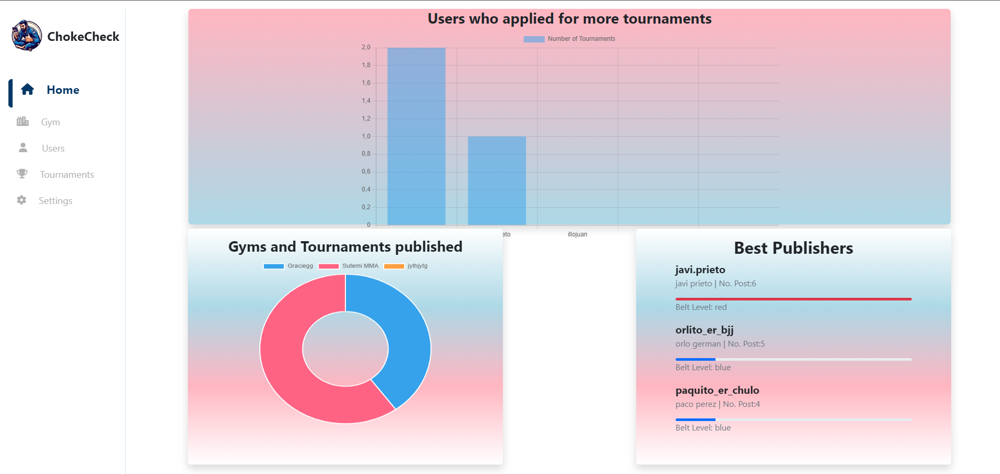
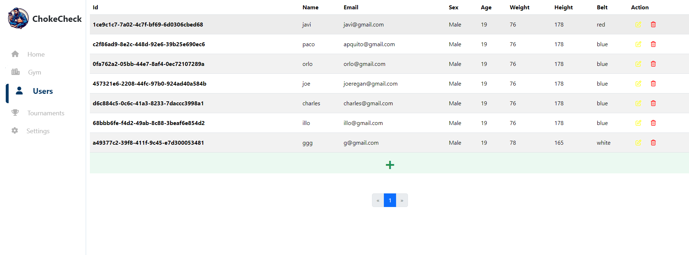

# ChokeCheck

---
## Índice
1. Descripción del Proyecto
2. Estado del Proyecto
3. Demostración de funciones y aplicaciones
4. Despliegue del Proyecto: tanto de la app Flutter como de la API
5. Tecnologías utilizadas
6. Personas Desarrolladoras del Proyecto
7. Licencia
---

## Descripción del Proyecto

ChokeCheck es una aplicación para los amantes del Brazilian Jiu Jitsu. En esta red social podrás compartir tus entrenamientos, consejos o actualizaciones sobre tí. Además podrás anotarte a torneos publicados por distintos gimnasios pudiendo recibir o no un premio por ganarlo. Conoce a gente que le guste tanto como a tí el BJJ en ChokeCheck.

## Estado del Proyecto
El proyecto se encuentra actualmente en desarrollo en su versión 1.0.

## Demostración de funciones y aplicaciones
Actualmente en la aplicación puedes realizar diferentes funciones que las vamos a dividir según las pantallas que podemos ver:
### APP MOVIL

#### Acceso
En el acceso a la app podremos ver la opción de Iniciar Sesión o Registrarse, clickando en registrarse podremos subir o tomar una foto de nuestro dispositivo para verificar que realmente somos practicantes de Brazilian JuJitsu está imagen será procesada por una inteligencia artificial que reconocerá si el cinturón subido es el mismo que el cinturón indicado por el usuario en el formulario de registro.

#### Post


Como vemos en esta pantalla vamos a poder realizar diferentes acciones:
- Pulsando en el corazón añadiremos un like a ese post
- Pulsando en la estrella veremos un formulario con 10 estrellas en el que podremos indicar como valoramos ese post
- Pulsando en el nombre del creador podremos consultar su perfil personal viendo allí sus post
- Pulsando en la papelera en los post de los que somos autores podrás borrar algunos de tus post
- Pulsando en el botón de arriba podrás añadir un nuevo post mediante un formulario

#### Tournament


Como vemos en esta pantalla vamos a poder realizar diferentes acciones:
- Desde aquí pulsando el botón central podremos apuntarnos o borrarnos de algún torneo
- Además pulsando en cualquiero punto que no sea el botón podremos acceder al detalle del torneo
- Podemos ver también en la parte de arriba la cantidad de personas apuntada
- El cinturón más alto que se puede apuntar al torneo es el que aparece a la derecha
- Puedes ver el precio por la victoria y después puedes ver un resumen de los datos.

#### Profile


Esta página es igual que el perfil personal al que podemos acceder clickando en el nombre de cualquier post que encontremos en la página inicial

Como vemos en esta pantalla vamos a poder realizar diferentes acciones:
- Si es nuestro perfil podemos borrar nuestros post, y podremos realizar todas las funcionalidades antes vistas solo que desde esta página
- Puedes ver los datos biometricos como peso, edad y sexo del usuario 
- Puedes ver una imagén con el cinturón con el que cuenta ese usuario.

### APP WEB
#### Home

En esta página principal podemos ver un resumen de lo sucedido en el último mes en nuestra applicación podemos ver
- Usuarios que se han apuntado a más torneos
- Usuario que han publicado más post
- Gimnasios que han publicado más torneos

#### El Resto de páginas

Las otras páginas son todas muy parecidas por tanto solo describiré una:
- Tabla con información sobre lo que estemos viendo (usuarios en este caso)
- Botones de acción al final de cada objeto para poder modificarlos o borrarlos
- Boton verde que abre un modal para poder añadir un nuevo objeto
- Paginador por si la lista de objetos fuera superior a 10 poder movernos comodamente por esta

## Despliegue del Proyecto
### Backend
Desde nuestra terminal accederemos a la carpeta ChokeCheckBack. Previo a esto deberemos tener instalado Docker y Java con JDK 17.

Con esto instalado y realizando estos 3 comando ejecutaríamos el proyecto de backend:
```
cd ChockeCheckBack
docker compose up -d
mvn: spring-boot run
```
### IA BACKEND
Desde nuestra terminal accederemos a la carpeta image_recognison_ai. Debemos tener previamente instalado Python 3.12.
Y seguir los siguientes comandos
``
cd image_recognison_ai
pip install requirements.txt
python ./model_training.py
python ./main.py
``
Y ahora tendremos habilitadas las funciones de este servicio.
### Frontend
Desde nuestra terminal accederemos a la carpeta chocke_check_front. Previo a esto debemos tener instalado Flutter y Dart.

Contando con esto y con estos 3 comandos se ejecutaría el proyecto de backend.
```
cd chocke_check_front
flutter pub get
flutter run ./lib/main.dart
```

## Tecnologías utilizadas
### Backend
Para la parte del backend hemos utilizado Java con el framework de Spring Boot en su versión 3.2.2.
Además de utilizar Python para generar una inteligencia artificial con ayuda de la librería de Tensorflow y Keras y un servicio de API con ayuda de FastAPI para tener acceso a esta.
### Frontend
Para el Frontend en el apartado móvil hemos utilizado Flutter y en el apartado web Angular..

## Desarrolladores
El único desarrollador de este proyecto soy yo Javier Prieto Ortiz


